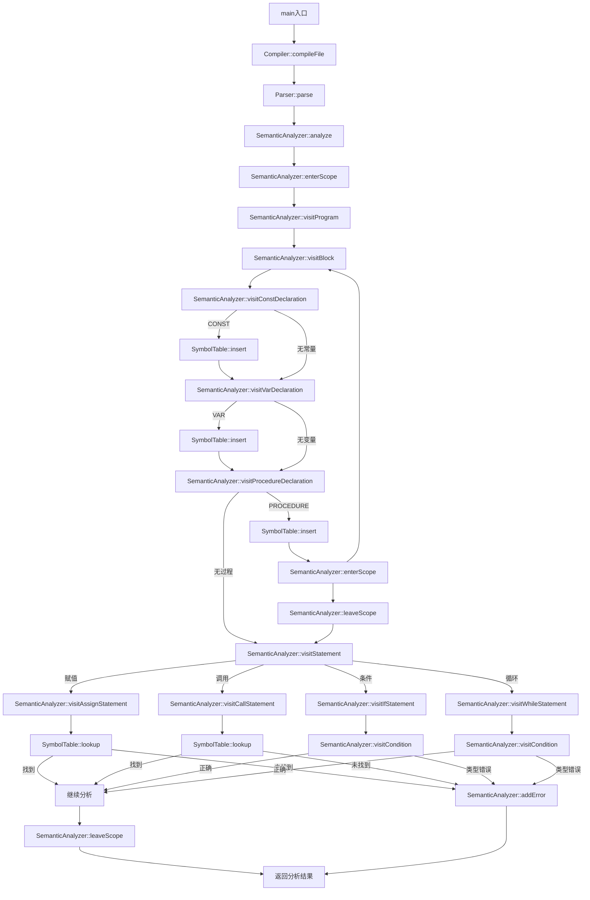
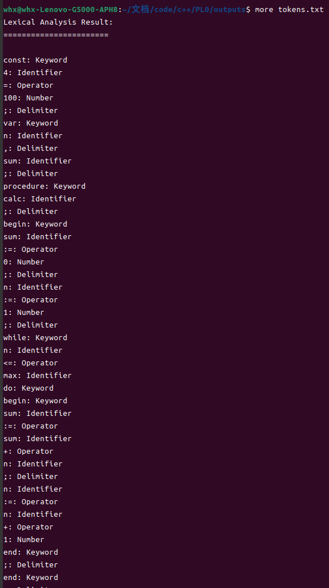

## 实验一&ensp;词法分析

### 一、实验目的
给出PL/0语言词法规范，编写PL/0语言的词法分析程序，并测试词法分析程序的正确性。

### 二、实验准备

#### 环境要求
若是编译失败，则一定先检查环境，c++20标准是必须的，本项目基于20标准进行设计的，有使用requires等进行模板约束
```
c++20+
make4.3+
g++12.3+
cmake3.24+
ubuntu22.04+
```

### 三、实验时间
2024.11.26

### 四、实验内容
1. 识别并分类以下词法单元:
   - 关键字(CONST, VAR, PROCEDURE等)
   - 运算符(+, -, *, /, :=等)
   - 界符(括号、逗号、分号等)
   - 标识符(以字母开头的字母数字串)
   - 常数(无符号整数)

2. 实现词法分析的核心功能:
   - 读取源程序文件
   - 识别并分类各类词法单元
   - 生成Token序列
   - 处理词法错误
   - 输出分析结果

3. 词法分析器的具体要求:
   - 能够正确识别PL/0语言的所有词法单元
   - 能够跳过空白字符和注释
   - 能够检测并报告词法错误
   - 支持源代码位置信息跟踪
   - 生成规范的Token序列输出

4. 输出要求:
   - Token序列应包含类型和值信息
   - 错误信息需指明位置和原因
   - 生成词法分析报告文件

### 五、基本原理

1. 词法分析基本概念
   - 词法分析是编译过程的第一个阶段
   - 将源程序文本分解成词法单元(Token)序列
   - Token是具有独立意义的最小语言单位

2. 词法分析器工作原理
   - 基于有限状态自动机(FSA)实现
   - 逐字符扫描源程序文本
   - 根据当前状态和输入字符确定下一状态
   - 当达到终止状态时识别出一个Token

3. Token的识别过程
   - 关键字识别：与预定义关键字表进行匹配
   - 标识符识别：字母开头，后跟字母或数字
   - 数字识别：连续数字串的处理和值计算
   - 运算符和界符：单字符或双字符的模式匹配

4. 错误处理机制
   - 词法错误的检测和定位
   - 错误恢复和继续分析
   - 错误信息的收集和报告

5. 辅助功能实现
   - 源代码位置跟踪
   - 注释和空白字符的处理
   - 符号表的建立和管理
   - 输出格式化和结果输出

### 六、实现过程

#### 1. 流程图
### 六、实现过程

#### 1. 流程图
&emsp;从主程序开始看，按照函数名所写


#### 2. 核心代码
##### 2.1 基础数据结构

1. **Token的完整定义**
```cpp:include/Token.h
class Token {
public:
    constexpr Token() noexcept : type_(TokenType::ERROR) {}
    constexpr Token(TokenType type) noexcept : type_(type) {}

    template <TokenValue T>
    constexpr Token(TokenType type, T value) noexcept
        : type_(type), value_(std::move(value)) {}

    [[nodiscard]] constexpr TokenType type() const noexcept { return type_; }

    template <typename T>
    [[nodiscard]] T value() const {
        return std::get<T>(value_);
    }

private:
    TokenType type_;
    std::variant<std::string_view, int64_t> value_;
};
```
Token类使用variant来存储不同类型的值，支持字符串视图(标识符)和整数(数值)。

##### 2.2 词法分析器实现

1. **词法分析器的初始化**
```cpp:src/TokenInterpreter.cpp
class TokenInterpreter {
private:
    std::string_view source_;
    size_t current_ = 0;
    size_t line_ = 1;
    size_t column_ = 1;

public:
    explicit TokenInterpreter(std::string_view source) noexcept 
        : source_(source) {}
}
```

2. **字符处理基础函数**
```cpp:src/TokenInterpreter.cpp
private:
    [[nodiscard]] char peek() const noexcept {
        return current_ >= source_.length() ? '\0' : source_[current_];
    }

    [[nodiscard]] char peekNext() const noexcept {
        return (current_ + 1) >= source_.length() ? '\0' : source_[current_ + 1];
    }

    char advance() noexcept {
        char c = peek();
        current_++;
        if (c == '\n') {
            line_++;
            column_ = 1;
        } else {
            column_++;
        }
        return c;
    }
```

3. **空白字符和注释处理**
```cpp:src/TokenInterpreter.cpp
void skipWhitespace() noexcept {
    while (true) {
        char c = peek();
        switch (c) {
            case ' ':
            case '\r':
            case '\t':
                advance();
                break;
            case '\n':
                advance();
                break;
            default:
                return;
        }
    }
}
```

4. **标识符和关键字解析**
```cpp:src/TokenInterpreter.cpp
std::optional<Token> tryReadIdentifier() noexcept {
    if (!isAlpha(peek())) {
        return std::nullopt;
    }

    size_t start = current_;
    while (isAlphaNum(peek())) {
        advance();
    }

    std::string_view text = source_.substr(start, current_ - start);
    
    // 检查是否是关键字
    if (auto keyword = lookupKeyword(text)) {
        return Token{*keyword};
    }
    
    return Token{TokenType::IDENTIFIER, text};
}

static std::optional<TokenType> lookupKeyword(std::string_view text) noexcept {
    static const std::unordered_map<std::string_view, TokenType> keywords = {
        {"const", TokenType::CONST},
        {"var", TokenType::VAR},
        {"procedure", TokenType::PROCEDURE},
        {"call", TokenType::CALL},
        {"begin", TokenType::BEGIN},
        {"end", TokenType::END},
        {"if", TokenType::IF},
        {"then", TokenType::THEN},
        {"while", TokenType::WHILE},
        {"do", TokenType::DO},
        {"odd", TokenType::ODD}
    };

    if (auto it = keywords.find(text); it != keywords.end()) {
        return it->second;
    }
    return std::nullopt;
}
```

5. **数字解析**
```cpp:src/TokenInterpreter.cpp
std::optional<Token> tryReadNumber() noexcept {
    if (!isDigit(peek())) {
        return std::nullopt;
    }

    size_t start = current_;
    int64_t value = 0;

    while (isDigit(peek())) {
        char digit = peek();
        if (value > (std::numeric_limits<int64_t>::max() - (digit - '0')) / 10) {
            std::cerr << "数字溢出: " << source_.substr(start, current_ - start) << '\n';
            return Token{TokenType::ERROR};
        }
        value = value * 10 + (digit - '0');
        advance();
    }

    return Token{TokenType::NUMBER, value};
}
```

6. **运算符和界符解析**
```cpp:src/TokenInterpreter.cpp
std::optional<Token> tryReadOperator() noexcept {
    char c = peek();
    switch (c) {
        case '+': advance(); return Token{TokenType::PLUS};
        case '-': advance(); return Token{TokenType::MINUS};
        case '*': advance(); return Token{TokenType::MULTIPLY};
        case '/': advance(); return Token{TokenType::DIVIDE};
        case '^': advance(); return Token{TokenType::POWER};
        case '=': advance(); return Token{TokenType::EQ};
        case '#': advance(); return Token{TokenType::NEQ};
        case '<': 
            advance();
            if (peek() == '=') {
                advance();
                return Token{TokenType::LTE};
            }
            return Token{TokenType::LT};
        case '>':
            advance();
            if (peek() == '=') {
                advance();
                return Token{TokenType::GTE};
            }
            return Token{TokenType::GT};
        case ':':
            advance();
            if (peek() == '=') {
                advance();
                return Token{TokenType::ASSIGN};
            }
            return Token{TokenType::ERROR};
    }
    return std::nullopt;
}
```

7. **主循环获取Token**
```cpp:src/TokenInterpreter.cpp
Token nextToken() noexcept {
    skipWhitespace();

    if (current_ >= source_.length()) {
        return Token{TokenType::END_OF_FILE};
    }

    // 尝试解析各种类型的Token
    if (auto token = tryReadIdentifier()) {
        return *token;
    }
    if (auto token = tryReadNumber()) {
        return *token;
    }
    if (auto token = tryReadOperator()) {
        return *token;
    }
    
    // 处理界符
    char c = advance();
    switch (c) {
        case '(': return Token{TokenType::LPAREN};
        case ')': return Token{TokenType::RPAREN};
        case ',': return Token{TokenType::COMMA};
        case ';': return Token{TokenType::SEMICOLON};
        case '.': return Token{TokenType::PERIOD};
    }

    return Token{TokenType::ERROR};
}
```

##### 2.3 解析过程说明

1. **初始化阶段**
- 创建TokenInterpreter实例，传入源代码
- 初始化位置指针和行列计数器

2. **Token识别过程**
- 跳过空白字符
- 根据当前字符特征选择相应的解析函数
- 使用peek()预读字符，使用advance()推进位置
- 返回解析得到的Token

3. **错误处理**
- 数字溢出检查
- 非法字符检测
- 不完整运算符处理（如单独的':'）

4. **位置跟踪**
- 维护行号和列号
- 处理换行符对位置的影响

#### 3.运行结果
ps：最开始用于测试的程序比较复杂，此处选择resources/test.pl0进行测试  


#### 4.运行截图


### 七、实验总结
#### 1. 实验过程分析

1. **设计阶段**
   - 首先设计了Token的数据结构，使用variant存储不同类型的值
   - 设计了词法分析器的整体架构，采用面向对象的方式实现
   - 规划了错误处理和位置跟踪机制

2. **实现难点**
   - 数字溢出处理：需要在累加过程中进行溢出检查
   - 运算符识别：需要处理单字符和双字符运算符的歧义
   - 位置跟踪：在处理每个字符时都需要正确更新行列信息

3. **优化过程**
   - 使用string_view代替string，避免不必要的字符串拷贝
   - 采用noexcept标记提高性能
   - 使用optional返回值处理可能的解析失败情况

4. **测试阶段**
   - 对各类Token进行单元测试
   - 测试错误处理机制
   - 验证位置信息的准确性
   - 进行边界条件测试

5. **遇到的问题及解决方案**
   - 问题：关键字和标识符的区分
     - 解决：先按标识符规则读取，然后查表确定是否为关键字
   
   - 问题：运算符的贪心匹配
     - 解决：使用peek()预读下一个字符，确定是否为双字符运算符

   - 问题：错误恢复机制
     - 解决：发现错误后跳过当前字符，继续下一个Token的解析

6. **改进空间**
   - 可以添加更详细的错误信息
   - 可以优化关键字查找的性能
   - 可以增加对Unicode字符的支持
   - 可以添加注释处理功能

#### 2. 心得体会
1. 通过本次实验，我深入理解了词法分析器的工作原理和实现方法，掌握了如何将理论知识转化为实际代码。
2. 应用了C++20的requires、c++17的optional、variant等新特性的使用，提高了代码的健壮性和可维护性。
3. 通过错误处理和位置跟踪机制的实现，增强了程序的容错能力和调试效率。
4. 通过单元测试和边界条件测试，提高了代码的可靠性和稳定性。

吐槽一句：模板真难调试
