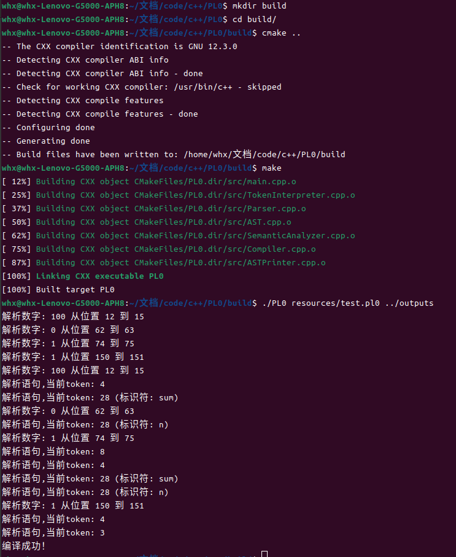

## 实验三&ensp;语义分析

### 一、实验目的
在语法分析的基础上实现PL/0语言的语义分析器，对抽象语法树进行语义检查，验证程序的语义正确性，为后续的代码生成做准备。

### 二、实验准备

#### 环境要求
与前两个实验相同的环境配置:
```
c++20+
make4.3+
g++12.3+
cmake3.24+
ubuntu22.04+
```

### 三、实验时间
2024.11.26

### 四、实验内容

1. **符号表管理**
   - 设计符号表数据结构
   - 实现作用域管理
   - 处理符号声明和查找
   - 支持嵌套作用域

2. **语义规则检查**
   - 变量声明和使用检查
   - 类型检查和转换
   - 运算符语义验证
   - 控制流语义检查

3. **作用域分析**
   - 变量作用域确定
   - 名字绑定分析
   - 变量生命周期管理
   - 作用域嵌套处理

4. **错误处理**
   - 重复声明检测
   - 未声明使用检测
   - 类型错误检测
   - 错误信息生成

5. **语义信息收集**
   - 收集变量信息
   - 记录类型信息
   - 保存作用域信息
   - 准备代码生成所需信息

### 五、基本原理

1. **语义分析基本概念**
   - 语义分析是编译过程的第三个阶段
   - 检查程序的语义正确性
   - 收集和组织语义信息
   - 为代码生成提供必要信息

2. **符号表技术**
   - 符号表是语义分析的核心数据结构
   - 记录标识符的属性信息
   - 管理嵌套的作用域
   - 支持快速的符号查找

3. **语义规则**
   - 标识符声明和使用规则
   - 类型相容性规则
   - 运算符使用规则
   - 控制流语句规则

4. **作用域规则**
   - 块作用域规则
   - 名字可见性规则
   - 名字遮蔽规则
   - 生命周期规则

5. **语义错误处理**
   - 错误检测策略
   - 错误恢复机制
   - 错误信息生成
   - 错误定位技术

### 六、实现过程

#### 1. 流程图


#### 2. 核心代码

1. **语义分析器的基本结构**
```cpp:include/SemanticAnalyzer.h
class SemanticAnalyzer : public ASTVisitor {
public:
    bool analyze(const Program &program);
    const std::vector<std::string> &getErrors() const { return errors_; }

private:
    void visit(const Program &node) override;
    void visit(const Block &node) override;
    void visit(const ConstDeclaration &node) override;
    void visit(const VarDeclaration &node) override;
    void visit(const ProcedureDeclaration &node) override;
    void visit(const AssignStatement &node) override;
    void visit(const CallStatement &node) override;
    
    void enterScope();
    void leaveScope();
    void addError(const std::string &message);
    
    std::vector<std::string> errors_;
    std::vector<SymbolTable> scopes_;
};
```

2. **符号表实现**
```cpp:src/SymbolTable.cpp
class SymbolTable {
public:
    bool insert(std::string_view name, Symbol symbol) {
        if (symbols_.contains(name)) {
            return false;
        }
        symbols_.emplace(name, std::move(symbol));
        return true;
    }

    Symbol* lookup(std::string_view name) {
        auto it = symbols_.find(name);
        return it != symbols_.end() ? &it->second : nullptr;
    }

private:
    std::unordered_map<std::string_view, Symbol> symbols_;
};
```

3. **作用域管理**
```cpp:src/SemanticAnalyzer.cpp
void SemanticAnalyzer::enterScope() {
    scopes_.emplace_back();
}

void SemanticAnalyzer::leaveScope() {
    if (!scopes_.empty()) {
        scopes_.pop_back();
    }
}

Symbol* SemanticAnalyzer::lookupSymbol(std::string_view name) {
    for (auto it = scopes_.rbegin(); it != scopes_.rend(); ++it) {
        if (auto symbol = it->lookup(name)) {
            return symbol;
        }
    }
    return nullptr;
}
```

##### 2.3 分析过程说明

1. **初始化阶段**
- 创建语义分析器实例
- 初始化全局符号表
- 准备错误收集器

2. **符号处理**
- 处理变量和常量声明
- 检查重复声明
- 记录符号属性
- 管理符号作用域

3. **语义检查**
- 变量使用前声明检查
- 类型兼容性检查
- 运算符语义检查
- 控制流语义验证

4. **信息收集**
- 收集变量信息
- 记录作用域信息
- 保存类型信息
- 准备代码生成数据

#### 3.运行结果


#### 4.运行截图
整个程序是串联的，通过cmake管理，一个运行截图就够了


### 七、实验总结

#### 1. 实验过程分析

1. **设计阶段**
   - 设计了分层的符号表结构
   - 实现了作用域管理机制
   - 规划了语义检查策略
   - 设计了错误处理机制

2. **实现难点**
   - 作用域嵌套处理：需要正确管理多层作用域
   - 符号查找算法：需要考虑作用域链
   - 类型检查系统：需要处理类型兼容性
   - 错误恢复策略：需要在错误后继续分析

3. **优化过程**
   - 优化符号表的查找效率
   - 改进作用域管理的内存使用
   - 增强错误信息的准确性
   - 优化语义检查的性能

4. **测试阶段**
   - 构造各类语义错误的测试用例
   - 验证作用域规则的正确性
   - 测试错误处理机制
   - 检查内存管理问题

5. **遇到的问题及解决方案**
   - 问题：作用域嵌套导致的符号查找效率问题
     - 解决：使用哈希表优化查找
   
   - 问题：多重声明的检测
     - 解决：在插入符号前进行检查

   - 问题：错误信息的精确定位
     - 解决：在AST节点中保存位置信息

6. **改进空间**
   - 可以添加更多的语义检查规则
   - 可以优化符号表的内存占用
   - 可以提供更详细的错误信息
   - 可以支持更复杂的类型系统

#### 2. 心得体会
都写在报告1里了