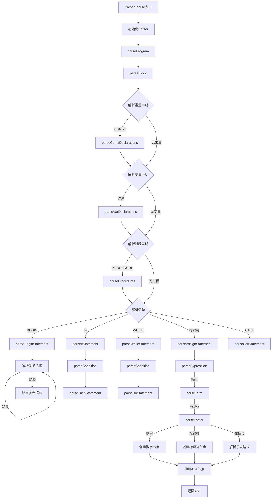
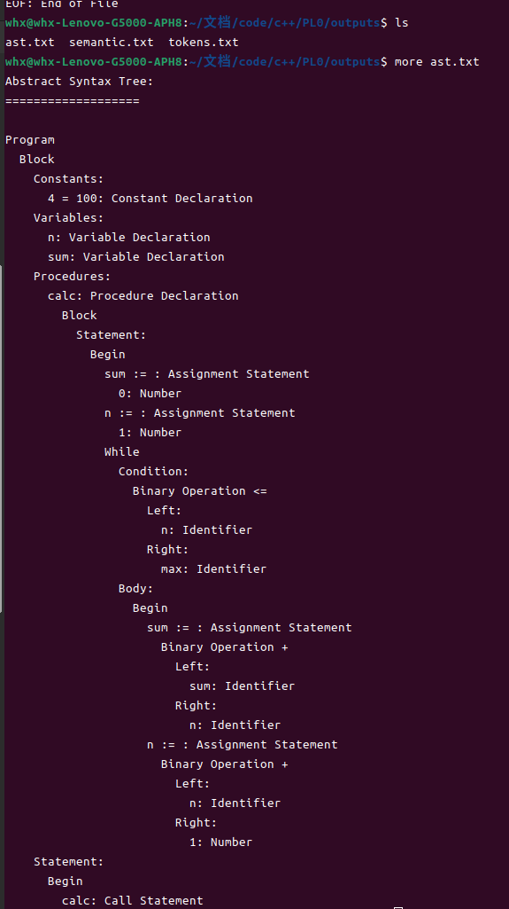
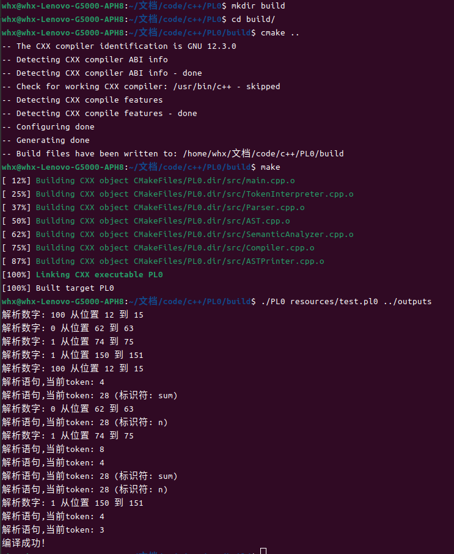

## 实验二&ensp;语法分析

### 一、实验目的
实现PL/0语言的语法分析器，将词法分析得到的Token序列转换为抽象语法树(AST)，为后续的语义分析和代码生成做准备。

### 二、实验准备

#### 环境要求
与词法分析相同的环境配置:
```
c++20+
make4.3+
g++12.3+
cmake3.24+
ubuntu22.04+
```

### 三、实验时间
2024.11.26

### 四、实验内容

1. **语法规则实现**
   - 程序结构(Program, Block)
   - 声明语句(常量、变量、过程)
   - 执行语句(赋值、调用、复合、条件、循环)
   - 表达式(算术、关系、逻辑)

2. **递归下降分析器实现**
   - 为每个非终结符设计解析函数
   - 处理产生式的选择和递归
   - 实现前看符号和预测分析
   - 构建抽象语法树(AST)

3. **错误处理机制**
   - 语法错误检测
   - 错误恢复策略
   - 错误信息生成
   - 错误位置定位

4. **AST节点设计**
   - 定义AST节点类型体系
   - 实现访问者模式
   - 支持节点遍历和打印
   - 保存必要的语法信息

5. **输出要求**
   - 生成语法分析报告
   - 输出AST结构
   - 记录错误信息
   - 提供分析统计数据

### 五、基本原理

1. **语法分析基本概念**
   - 语法分析是编译过程的第二个阶段
   - 将Token序列转换为抽象语法树(AST)
   - AST是源代码的结构化表示，反映程序的语法结构

2. **递归下降分析**
   - 采用递归下降法实现语法分析
   - 为每个非终结符设计一个解析函数
   - 使用前看符号进行预测分析
   - 通过递归调用处理嵌套结构

3. **语法规则**
   - 使用BNF(巴科斯范式)描述PL/0语言的语法
   - 处理程序、块、声明、语句和表达式等结构
   - 支持算术、关系和逻辑表达式

4. **错误处理机制**
   - 语法错误的检测和报告
   - 错误恢复策略：跳过错误Token，继续分析
   - 提供详细的错误信息，包括位置和原因

5. **抽象语法树(AST)**
   - AST节点表示程序的语法结构
   - 使用访问者模式遍历和处理AST
   - 支持语法树的打印和可视化
   - 为后续的语义分析和代码生成提供基础

### 六、实现过程

#### 1. 流程图



#### 2. 核心代码

1. **Parser类的基本结构**
```cpp:include/Parser.h
class Parser {
public:
    explicit Parser(TokenInterpreter lexer) noexcept
        : lexer_(std::move(lexer)) {}

    [[nodiscard]] std::unique_ptr<Program> parse();
    [[nodiscard]] const std::vector<std::string> &getErrors() const noexcept
    {
        return errors_;
    }

private:
    // 递归下降解析方法
    [[nodiscard]] std::unique_ptr<Program> parseProgram();
    [[nodiscard]] std::unique_ptr<Block> parseBlock();
    [[nodiscard]] std::vector<std::unique_ptr<ConstDeclaration>> parseConstDeclarations();
    [[nodiscard]] std::vector<std::unique_ptr<VarDeclaration>> parseVarDeclarations();
    [[nodiscard]] std::vector<std::unique_ptr<ProcedureDeclaration>> parseProcedures();
    [[nodiscard]] std::unique_ptr<Statement> parseStatement();
    
    TokenInterpreter lexer_;
    std::vector<std::string> errors_;
};
```

2. **语句解析示例**
```cpp:src/Parser.cpp
std::unique_ptr<Statement> Parser::parseCallStatement()
{
    [[maybe_unused]] auto call_token = advance(); // 消费CALL
    auto name = consume(TokenType::IDENTIFIER, "CALL语句需要过程名");
    return std::make_unique<CallStatement>(name.value<std::string_view>());
}

std::unique_ptr<Statement> Parser::parseBeginStatement()
{
    [[maybe_unused]] auto begin_token = advance(); // 消费BEGIN
    std::vector<std::unique_ptr<Statement>> statements;

    while (!check(TokenType::END))
    {
        auto stmt = parseStatement();
        if (stmt)
        {
            statements.push_back(std::move(stmt));
        }

        if (!match(TokenType::SEMICOLON) && !check(TokenType::END))
        {
            error("语句之间需要分号");
        }
    }

    [[maybe_unused]] auto end_token = consume(TokenType::END, "BEGIN语句需要以END结束");
    return std::make_unique<BeginStatement>(std::move(statements));
}
```

3. **AST节点设计**
```cpp:include/AST.h
class Block : public ASTNode<Block>
{
public:
    Block(std::vector<std::unique_ptr<ConstDeclaration>> consts,
          std::vector<std::unique_ptr<VarDeclaration>> vars,
          std::vector<std::unique_ptr<ProcedureDeclaration>> procedures,
          std::unique_ptr<Statement> statement)
        : consts_(std::move(consts)),
          vars_(std::move(vars)),
          procedures_(std::move(procedures)),
          statement_(std::move(statement)) {}

    void accept(ASTVisitor &visitor) const override;

    [[nodiscard]] const auto &consts() const noexcept { return consts_; }
    [[nodiscard]] const auto &vars() const noexcept { return vars_; }
    [[nodiscard]] const auto &procedures() const noexcept { return procedures_; }
    [[nodiscard]] const auto &statement() const noexcept { return *statement_; }

private:
    std::vector<std::unique_ptr<ConstDeclaration>> consts_;
    std::vector<std::unique_ptr<VarDeclaration>> vars_;
    std::vector<std::unique_ptr<ProcedureDeclaration>> procedures_;
    std::unique_ptr<Statement> statement_;
};
```

##### 2.3 解析过程说明

1. **初始化过程**
- 创建Parser实例，接收词法分析器
- 初始化错误收集器
- 准备AST节点构建

2. **递归下降分析**
- 从Program开始，自顶向下分析
- 每个非终结符对应一个解析函数
- 使用前看符号进行预测分析
- 递归处理嵌套结构

3. **错误处理**
- 同步标记的选择
- 错误恢复策略
- 错误信息的收集
- 位置信息的跟踪

4. **AST构建**
- 节点的创建和连接
- 属性的收集和存储
- 访问者模式的实现
- 树形结构的维护

#### 3.运行结果
ps：最开始用于测试的程序比较复杂，此处选择resources/test.pl0进行测试  


#### 4.运行截图
整个程序是串联的，通过cmake管理，一个运行截图就够了


### 七、实验总结

#### 1. 实验过程分析

1. **设计阶段**
   - 设计了完整的AST节点体系，包括各类声明、语句和表达式节点
   - 采用访问者模式设计AST遍历机制
   - 规划了错误恢复和同步策略
   - 设计了Parser类的整体架构

2. **实现难点**
   - 表达式优先级处理：需要正确处理运算符优先级和结合性
   - 递归下降实现：需要避免左递归，处理回溯问题
   - 错误恢复：在发生语法错误时需要继续分析
   - AST构建：需要在分析过程中同步构建语法树

3. **优化过程**
   - 使用智能指针管理AST节点内存
   - 优化递归下降函数的调用栈
   - 改进错误恢复机制，提高分析的容错能力
   - 优化AST节点的内存布局

4. **测试阶段**
   - 构造各类语法结构的测试用例
   - 验证AST构建的正确性
   - 测试错误处理和恢复机制
   - 检查内存泄漏问题

5. **遇到的问题及解决方案**
   - 问题：左递归导致的无限递归
     - 解决：重写文法，消除左递归
   
   - 问题：表达式解析的歧义
     - 解决：使用运算符优先级表和递归下降相结合

   - 问题：错误恢复点的选择
     - 解决：选择合适的同步标记集合

6. **改进空间**
   - 可以添加更多的语法检查
   - 可以优化AST的内存占用
   - 可以改进错误提示的精确度
   - 可以增加语法树可视化功能

#### 2. 心得体会
都写在报告1里了